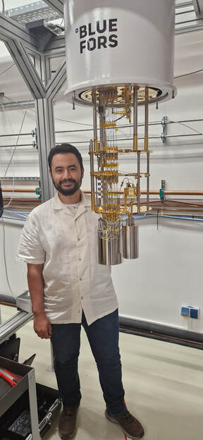

::: {.hero-wrap}
::: {.hero-copy}

Quantum computing · Quantum thermodynamics

## Zakaria Mzaouali

### Theoretical physicist studying how information, energy, and computation meet in quantum systems.

I am a researcher at the **University of Tübingen**. My work combines analytical theory, numerical methods, and experiments on quantum hardware to understand what quantum devices compute, how reliably they do it, and what physical resources the computation consumes.

::: {.hero-actions}
[Explore my research](research.qmd){.btn .btn-primary .btn-lg}
[View publications](publications.qmd){.btn .btn-outline-primary .btn-lg}
:::

::: {.hero-links}
[Email](mailto:zakaria.mzaouali@uni-tuebingen.de)
[Google Scholar](https://scholar.google.com/citations?user=OEWZC-EAAAAJ&hl=en)
[GitHub](https://github.com/MoorishQubit)
[ORCID](https://orcid.org/0000-0003-3948-1318)
:::
:::

::: {.hero-portrait}

 Tübingen, Germany

:::
:::

::: {.content-band}

Research focus

## From fundamental physics to testable quantum technologies

::: {.research-grid}
::: {.research-card}
01

### Quantum computing

Algorithms, encodings, and hardware-aware tests for quantum annealers and gate-based processors.
:::

::: {.research-card}
02

### Quantum thermodynamics

Work, heat, irreversibility, and energy efficiency during real computational protocols.
:::

::: {.research-card}
03

### Many-body physics

Equilibrium and dynamical critical phenomena, spin models, and non-equilibrium control.
:::

::: {.research-card}
04

### Quantum information

Phase-space signatures, correlations, entanglement, and information transfer in interacting systems.
:::
:::
:::

::: {.home-section}
::: {.section-heading}

Selected work

## Recent research

[All publications →](publications.qmd){.section-link}
:::

::: {.featured-list}
::: {.featured-paper}

2026

### [Quantum annealers as programmable thermal machines](https://arxiv.org/abs/2608.04564)

An experimental and theoretical study of quantum annealers as thermodynamic processes, connecting programmable schedules with energy exchange and entropy production.

`Quantum annealing`{.topic-tag} `Thermodynamics`{.topic-tag}

:::

::: {.featured-paper}

2026

### [Thermodynamic significance of QUBO encoding on quantum annealers](https://doi.org/10.1088/1367-2630/ae6e98)

Penalty choices in a QUBO do more than change computational performance: they reshape the energy landscape and the measured thermodynamic cost.

`New Journal of Physics`{.venue-tag} `QUBO`{.topic-tag}

:::

::: {.featured-paper}

2026

### [Quantum-inspired dynamical models on quantum and classical annealers](https://journals.aps.org/prapplied/abstract/10.1103/rrf3-jm5m)

A common optimization formulation for testing quantum and classical annealers on models derived from real-time quantum dynamics.

`Physical Review Applied`{.venue-tag} `Benchmarking`{.topic-tag}

:::
:::
:::

::: {.home-section .news-section}
::: {.section-heading}

Updates

## Recent milestones

:::

::: {.timeline}
::: {.timeline-item}
<time>August 2026</time>

<strong>New preprint:</strong> “Quantum annealers as programmable thermal machines” posted on arXiv.

:::

::: {.timeline-item}
<time>June 2026</time>

<strong>New preprint:</strong> “Chirality routing non-polaritonic vacuum correlations in Landau polaritons.”

:::

::: {.timeline-item}
<time>May 2026</time>

“Thermodynamic significance of QUBO encoding on quantum annealers” published in <em>New Journal of Physics</em>.

:::

::: {.timeline-item}
<time>April 2026</time>

“Quantum-inspired dynamical models on quantum and classical annealers” published in <em>Physical Review Applied</em>.

:::
:::
:::

::: {.contact-band}

Collaboration

## Interested in quantum hardware, thermodynamics, or many-body physics?

I welcome conversations about research collaborations, seminars, and joint projects.

[Get in touch](mailto:zakaria.mzaouali@uni-tuebingen.de){.btn .btn-light .btn-lg}
:::
